# SailPoint IdentityIQ HR Source and Aggregation Lab

**One HR file. Three identities. Every manager linked.**

This is Week 5 of my 12 week IAM Engineer portfolio. I connected a delimited HR file to SailPoint IdentityIQ 8.3 as an authoritative source, built a 13 attribute schema, set up correlation and identity mappings, and aggregated three test employees into identities. Then I made the manager relationships work, which took the longest and taught me the most.

Every claim in this write up is backed by a screenshot or a raw evidence file in this repo.

---

## The 30 second version

| Question | Answer |
|---|---|
| **What problem does this solve?** | Before an identity platform can grant, review, or remove access, it has to know who works at the company, what their attributes are, and who they report to. Without one trusted source, that knowledge lives in spreadsheets and inboxes. |
| **What did I build?** | One IdentityIQ application that reads an HR file as the authoritative source, with a 13 attribute schema, correlation on Employee ID, six identity mappings, and manager correlation that links two employees to their manager. |
| **How did I prove it works?** | Task results showing 3 accounts scanned and 3 identities created, one account with all 13 attributes populated, an identity search showing the stored Employee IDs, reruns that updated the same three identities instead of duplicating them, and an Is Manager search that went from zero results to returning the manager. |
| **Tools** | SailPoint IdentityIQ 8.3, Apache Tomcat 9.0.60, MySQL 8, Java 11, VS Code, IdentityIQ Advanced Analytics |
| **Built on** | September 19, 2026 |

---

## Explain it like I am in 5th grade

Picture a school. The district sends the front office an official roster of every enrolled student. The secretary reads that roster and makes one folder for each student. Before she files anything, she works out which roster line belongs to which folder, so nobody ends up with two folders. Then she writes each student's name on the folder tab and writes down who each student's teacher is.

SailPoint is the secretary. The HR file is the roster. Nothing else in the company (email, apps, badges) should exist for a person until the roster says they do. That is why this lab starts here.

| Piece | School version | Real version |
|---|---|---|
| **Authoritative source** | The district's official roster. | The HR file. Everyone agrees it says who is real. |
| **Schema** | The column headings on the roster, like Name and Homeroom. | The list of 13 attributes and what each one means. |
| **Aggregation** | The secretary reads the roster and makes a folder for every student. | SailPoint reads the file and builds an identity for each person. |
| **Correlation** | Deciding which roster line belongs in which folder, so nobody gets two. | A rule that matches each account to an identity. Here it matches on Employee ID. |
| **Identity mapping** | Writing the name on the folder tab. | Deciding which HR column fills each field on the identity. |
| **Manager correlation** | Writing down who each student's teacher is. | Linking each employee to their manager's identity. |
| **Identity refresh** | The secretary walks back over the folders and updates what is written on them. | A task that recalculates the values stored on each identity. |

My curriculum uses Identity Security Cloud words, and I built this on IdentityIQ 8.3 running on my own laptop. Here is the translation:

| Curriculum word (Identity Security Cloud) | What I clicked (IdentityIQ) |
|---|---|
| Source | Application |
| Identity Profile | Identity Mappings plus Correlation |
| SFTP delivery | A local file path |

### Words you will see

| Word | Simple meaning |
|---|---|
| Application | A connected source of accounts. Mine is the HR file. |
| Account | One person's record inside a source. One line of the CSV. |
| Identity | The single profile SailPoint builds for one person, made from their accounts. |
| Identity Warehouse | The screen that lists every identity. |
| Identity attribute | A field on the identity, like Email or Manager. |
| Display attribute | The account attribute humans see on screen. |
| Task | A job SailPoint runs, like an aggregation or a refresh. |
| Task result | The record of one run of a task. |

---

## The big picture

```
   hr_feed.csv   (3 employees, 13 columns)
        │
        ▼
   HR_Employee_Feed   (Delimited File application, authoritative)
        │
        │  aggregation
        ▼
   ┌───────────────────────────────────────────────────────────┐
   │  Correlation          employeeId  =  Employee ID          │
   │  Identity mappings    name, email, Employee ID, manager   │
   │  Manager correlation  managerId   →  Employee ID          │
   └───────────────────────────────────────────────────────────┘
        │
        ▼
   Identity Warehouse:  Ava Brooks   Marcus Reed   Priya Shah
                         └──── both report to ────┘
```

---

## Part 1: Connect the HR file as a source

### Situation
A company has an HR list but no central view of who works there. Before SailPoint can do anything useful, it has to be able to read that list and understand what every column means.

### Build
1. Created the HR file with three employees and 13 columns. Priya has no manager on purpose. She is the top of this small org, and I wanted a control case for the manager lookup later. The full file is in [`evidence/01_hr_feed.csv`](evidence/01_hr_feed.csv).

```
employeeId,firstName,lastName,displayName,email,department,jobTitle,managerId,location,hireDate,employmentStatus,employeeType,costCenter
E1001,Ava,Brooks,Ava Brooks,ava.brooks@iamlab.local,Finance,Financial Analyst,E1003,Atlanta,20260105,Active,Employee,CC100
E1002,Marcus,Reed,Marcus Reed,marcus.reed@iamlab.local,IT,Systems Administrator,E1003,Atlanta,20250310,Active,Employee,CC200
E1003,Priya,Shah,Priya Shah,priya.shah@iamlab.local,Operations,Director of Operations,,Atlanta,20230612,Active,Employee,CC300
```

2. Saved it as UTF 8 and checked the status bar. A hidden byte order mark at the start of a file can end up inside the first column name and cause confusing schema errors.

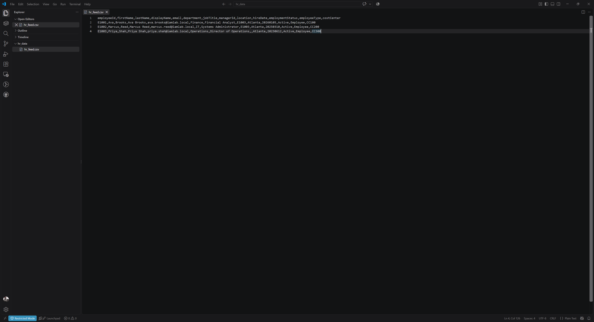
*Screenshot 01, Beginning: the HR file in VS Code with three employees and 13 columns. UTF 8 shows in the status bar, and `hr_feed.csv` is the only file in the folder.*

3. Logged in and opened the Identity Warehouse before touching anything. That gives me a clean "before" to compare against later.

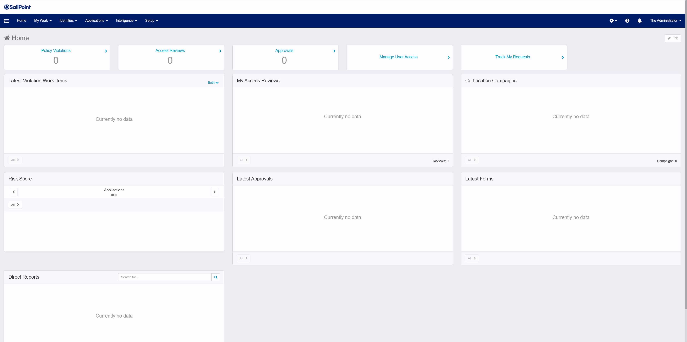
*Screenshot 02, Beginning: the IdentityIQ home page after logging in as spadmin. The platform is up.*

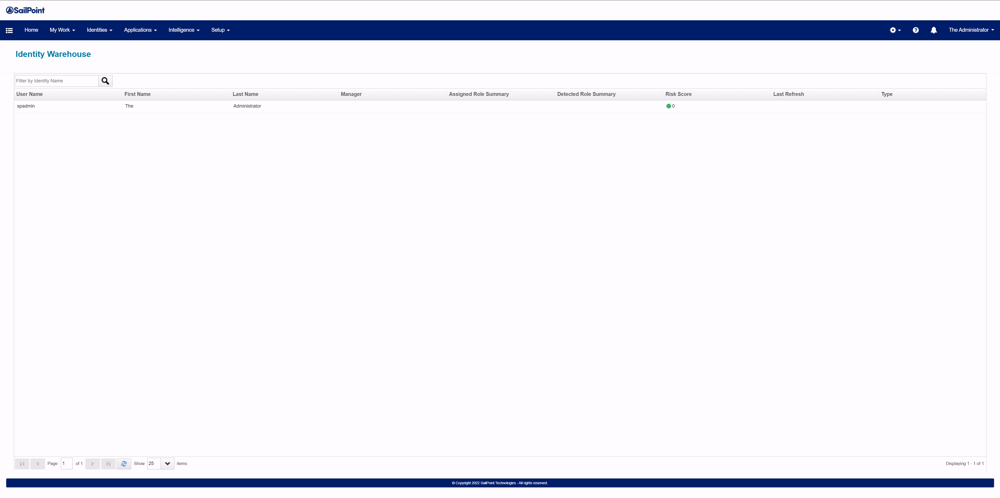
*Screenshot 03, Beginning: the Identity Warehouse before any aggregation. Only the default administrator, spadmin, exists.*

4. Created a Delimited File application named `HR_Employee_Feed`. File path `C:\SailPoint\hr_data\hr_feed.csv`, transport set to Local, delimiter a comma, header row on, encoding UTF8. I checked **Authoritative Application**, which tells SailPoint this file is the trusted answer for who exists.

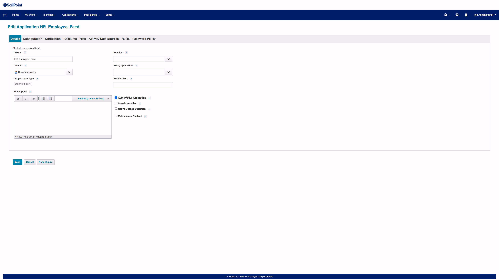
*Screenshot 04, Beginning: the HR_Employee_Feed application with Authoritative Application checked.*

5. Clicked **Test Connection**.

### Snag: the connection test read the file and still failed

I expected a green result. I got a red one.

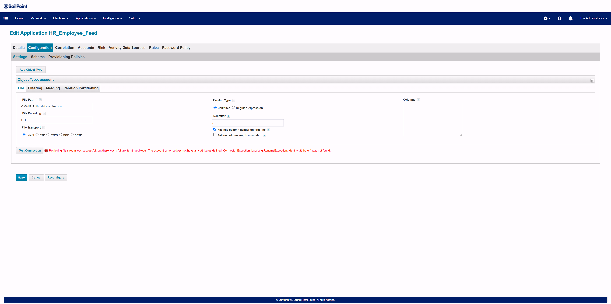
*Screenshot 05, Snag: the file stream was retrieved, but the account schema has no attributes defined.*

I read the message in three chunks, because each chunk ruled out a layer:

| Chunk of the message | What it told me |
|---|---|
| Retrieving file stream was successful | The file path, permissions, and encoding were all fine. That ruled out the whole file layer. |
| The account schema does not have any attributes defined | The real cause. SailPoint could open the file but had no column definitions. |
| Identity attribute [] was not found | A symptom of the same problem. The brackets were empty because no column had been named as the unique key yet. |

**Fix:** on the Schema tab I ran **Discover Schema Attributes**, which reads the header row. All 13 columns appeared. I set `employeeId` as the Identity Attribute (the unique badge number) and `displayName` as the Display Attribute (what humans see on screen), saved, and tested again.


*Screenshot 06, after the fix: employeeId set as the Identity Attribute. The popup confirms "Identity Property Set on Schema."*

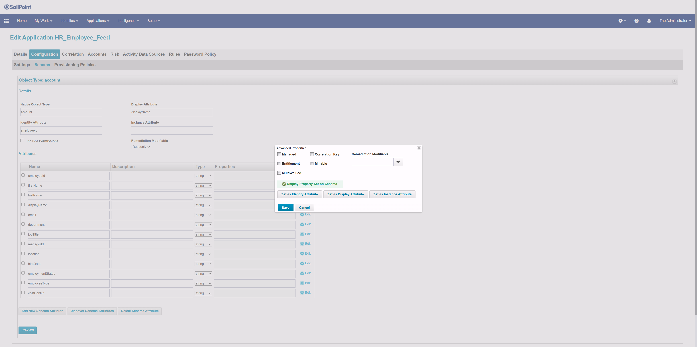
*Screenshot 07, after the fix: displayName set as the Display Attribute. The popup confirms "Display Property Set on Schema."*

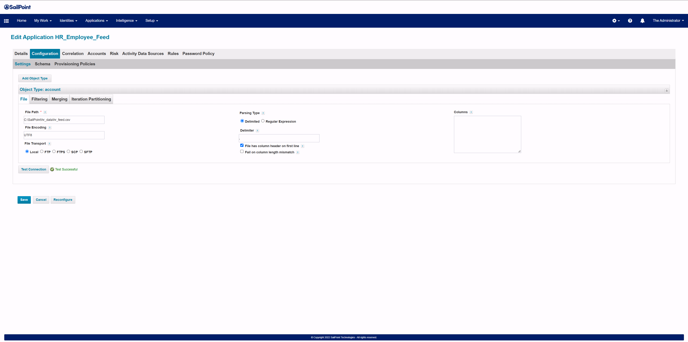
*Screenshot 08, Middle: Test Connection now reports Test Successful.*

### Engineer notes
* **A file that opens is not the same as a file SailPoint understands.** For a delimited file connector, the schema has to exist before the connection can be fully validated.
* **The identity attribute is the unique key.** Choosing it on purpose matters, because everything downstream leans on it. Part 3 shows what happened when I let the display attribute do more work than I planned.

### Real world mapping
"The connection test passes but the aggregation returns nothing" is a common connector ticket. Checking the schema and the identity attribute first would have saved me time here, and it will save time on the job.

---

## Part 2: Correlation and identity mappings

### Situation
Reading the file is not enough. SailPoint also has to decide which account belongs to which identity, and what to write on each identity once it exists.

### Build
1. **Correlation.** On the application's Correlation tab there was nothing configured. I created a correlation configuration called `HR_Employee_Feed_Correlation`. My first version matched the account's `employeeId` to the identity's **Name**. I replace this in Part 4, and I explain why there.

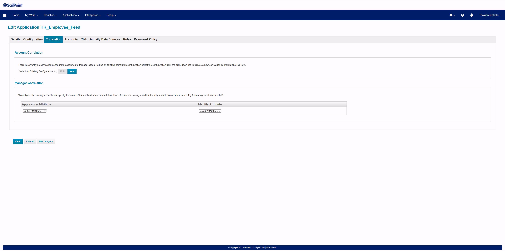
*Screenshot 09, Beginning: the Correlation tab before configuration. No correlation configuration is assigned and Manager Correlation is empty.*

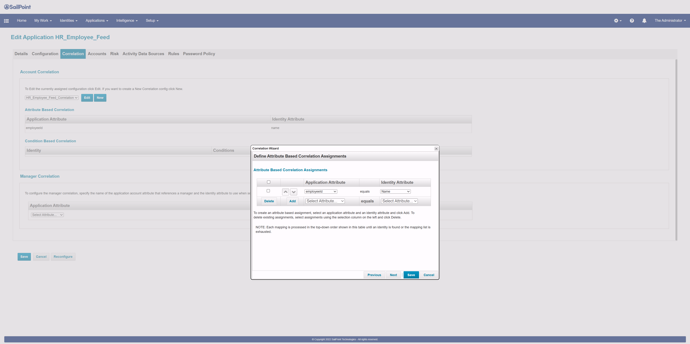
*Screenshot 10, Middle: the correlation wizard with my first rule, employeeId equals the identity's Name.*

2. **Identity mappings.** Correlation decides which folder. Identity mappings decide what gets written on the folder tab. Under Global Settings, Identity Mappings, I added the HR application as the source for Display Name, Email, First Name, and Last Name. Each one is an Application Attribute from `HR_Employee_Feed`, with "Add this source as a target" left unchecked, because SailPoint only reads from this source.

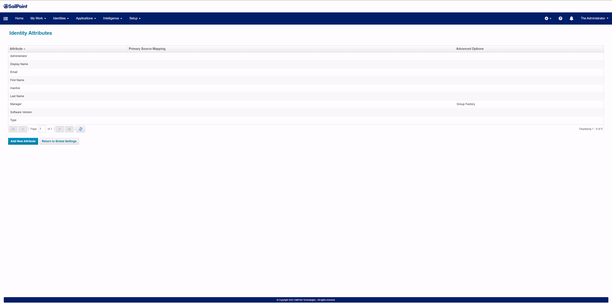
*Screenshot 11, Beginning: the Identity Attributes list with the Primary Source Mapping column empty.*

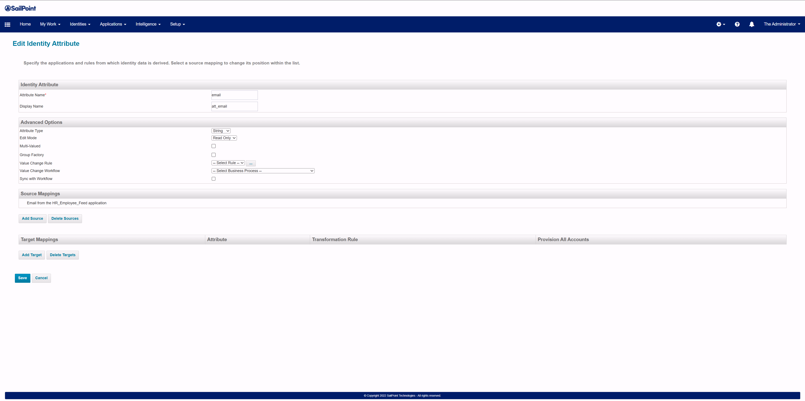
*Screenshot 12, Middle: the email attribute with its source saved. Source Mappings reads "Email from the HR_Employee_Feed application."*

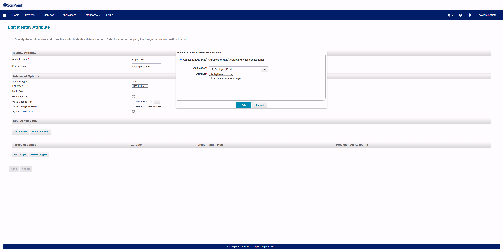
*Screenshot 13, Middle: the Add Source popup for displayName. Application Attribute, `HR_Employee_Feed`, `displayName`.*

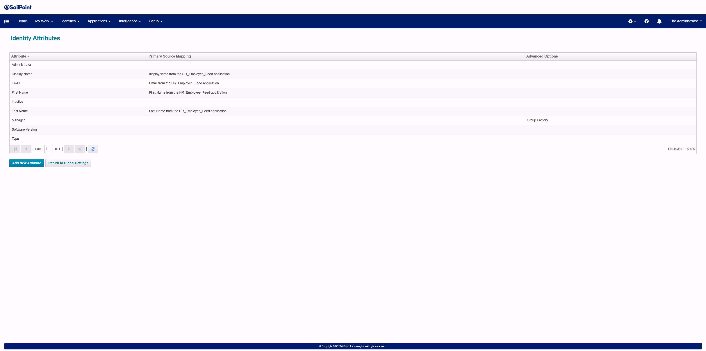
*Screenshot 14, End: the list with Display Name, Email, First Name, and Last Name all mapped to the HR application.*

### Engineer notes
* **Account correlation rules run top down until an identity is found.** That order matters, and it comes back in Part 4.
* **Correlation and identity mapping are different jobs.** Correlation answers "which identity is this account?" Mapping answers "what goes on the identity?"
* In Identity Security Cloud, the identity profile covers both jobs on one screen. In IdentityIQ they live in two places.

### Real world mapping
When someone says "the account attached to the wrong person," it is a correlation problem. When someone says "the email on the identity is blank," it is a mapping problem. Knowing which is which halves the debugging time.

---

## Part 3: The first aggregation

### Situation
Everything so far was setup. The aggregation is where the setup gets tested against real data.

### Build
Under Setup, Tasks, I created an **Account Aggregation** task for `HR_Employee_Feed`, left every option at its default, and ran it.

### Snag: the task name was rejected

My first attempt failed before it ran.

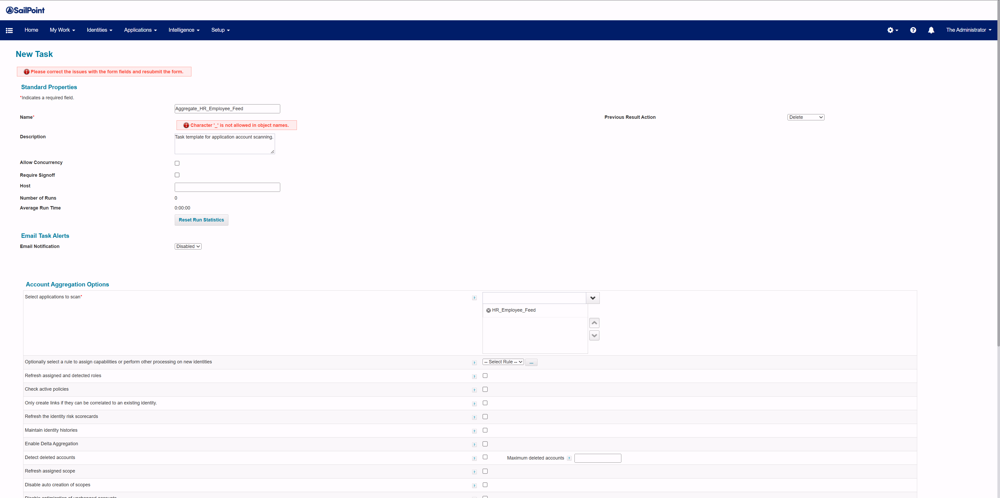
*Screenshot 15, Snag: "Please correct the issues with the form fields." Under the Name field, "Character '_' is not allowed in object names."*

The application name `HR_Employee_Feed` had already been accepted with underscores, so different object types have different naming rules. This was a platform validation rule and not a connector problem, which also told me that everything I had already proven working was still fine. **Fix:** I renamed the task with spaces.

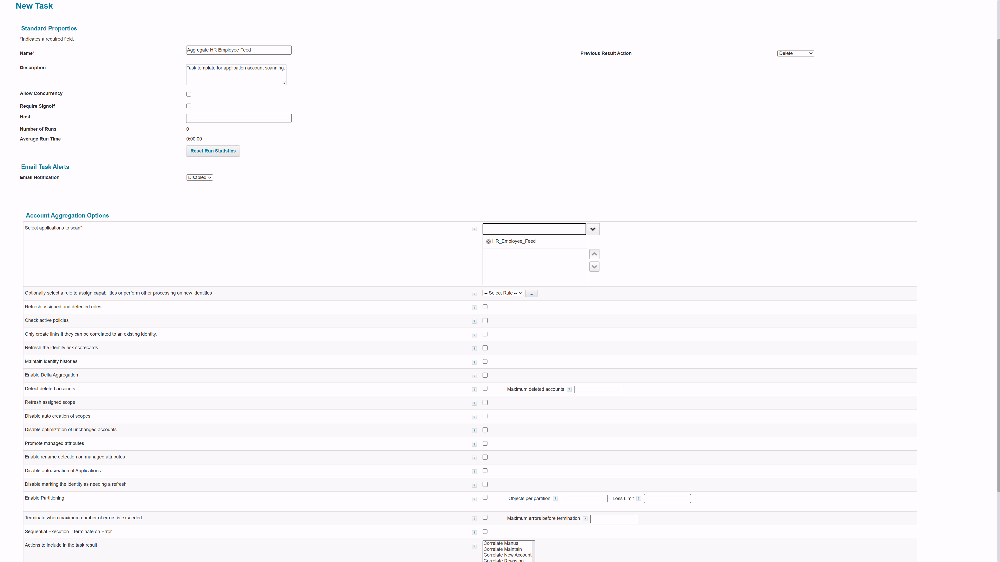
*Screenshot 16, after the fix: the task named "Aggregate HR Employee Feed." The application is selected and every option is at its default.*

Later, when I needed to rerun the job, IdentityIQ blocked me from creating a second task with the same name. I edited the existing task instead and set **Previous Result Action** to **Rename Old**, so every run stayed on record.

### What happened
The task finished in about one second: 3 accounts scanned and 3 identities created.

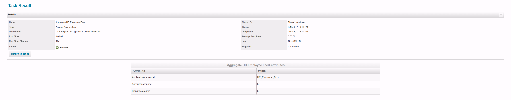
*Screenshot 17, Middle: the Task Result. Success, 3 accounts scanned, 3 identities created.*

The Identity Warehouse now listed three new identities beside spadmin, with first name, last name, and email filled in. One thing surprised me.

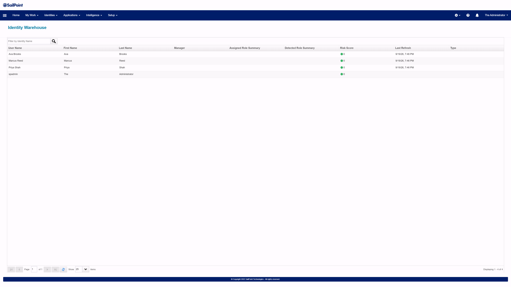
*Screenshot 18, Middle: the Identity Warehouse at 7:46 PM. The Username column reads "Ava Brooks," "Marcus Reed," and "Priya Shah." I had expected E1001, E1002, and E1003.*

IdentityIQ used the display attribute I had chosen on the schema, `displayName`, as each identity's username. That created two problems that I fix in Part 4.

I also checked where the 13 attributes actually live. They are on the **account**, not on the identity's Attributes tab, which only shows the attributes I mapped. So I opened the Application Accounts tab to prove all 13 landed.

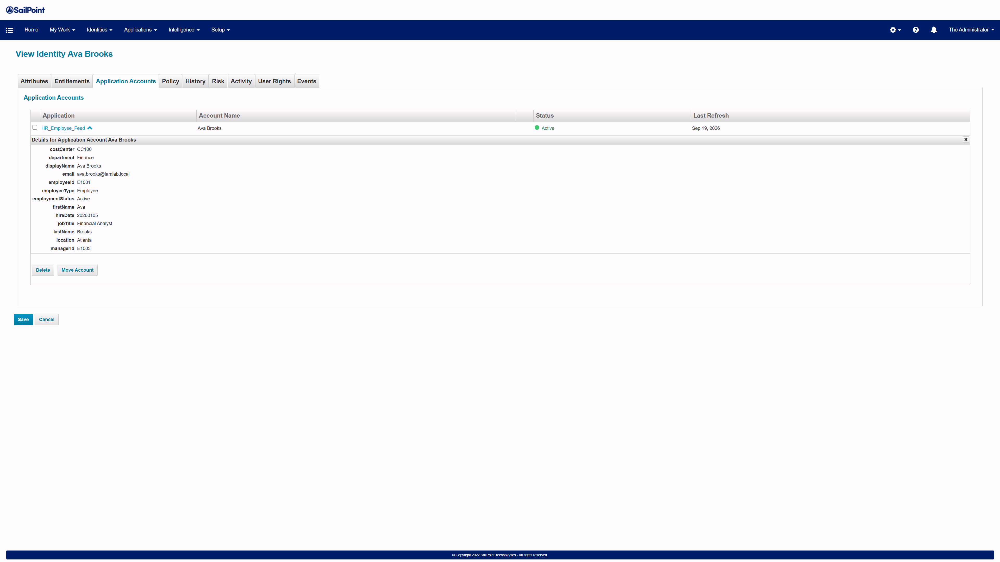
*Screenshot 19, End of this part: Ava Brooks's HR account with all 13 attributes populated, including `managerId` E1003.*

### Engineer notes
* **The first run only proves the happy path.** Every account was brand new, so any correlation rule would have looked fine. The real test is the rerun.
* **Check the data where it lives.** The identity's Attributes tab looked sparse, and the account tab showed it was complete.

### Real world mapping
"Success" on an aggregation only means the task finished. Whether the right people, attributes, and links came out is a separate question, and it is the one the business cares about.

---

## Part 4: Fixing the data model with an Employee ID attribute

### Situation
Usernames that are display names caused two real problems. First, the manager lookup needs an employee ID to search on, and no identity stored one. Second, my correlation rule compared an employee ID to a name. It only worked because every account was new. A future account with a matching ID would never have matched, and SailPoint would have made a duplicate identity.

### Build
1. Created a new identity attribute called **Employee ID** and checked **Searchable**, so I can find and match on it.

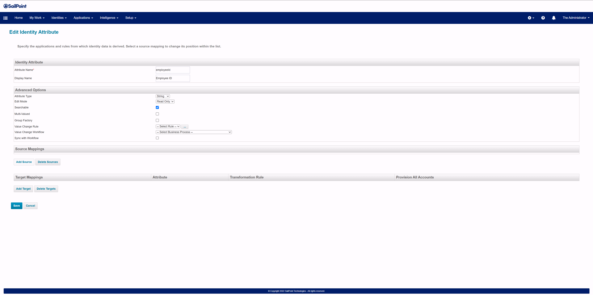
*Screenshot 20, Beginning: the new Employee ID attribute. Searchable is checked and Source Mappings is empty.*

2. Mapped it to `employeeId` from `HR_Employee_Feed`.

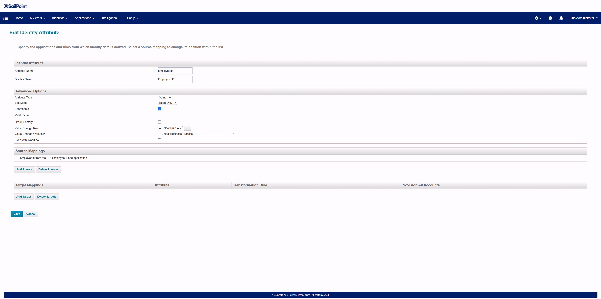
*Screenshot 21, after the fix: Source Mappings reads "employeeId from the HR_Employee_Feed application."*

3. Rebuilt the correlation rule so it matches `employeeId` to **Employee ID**.

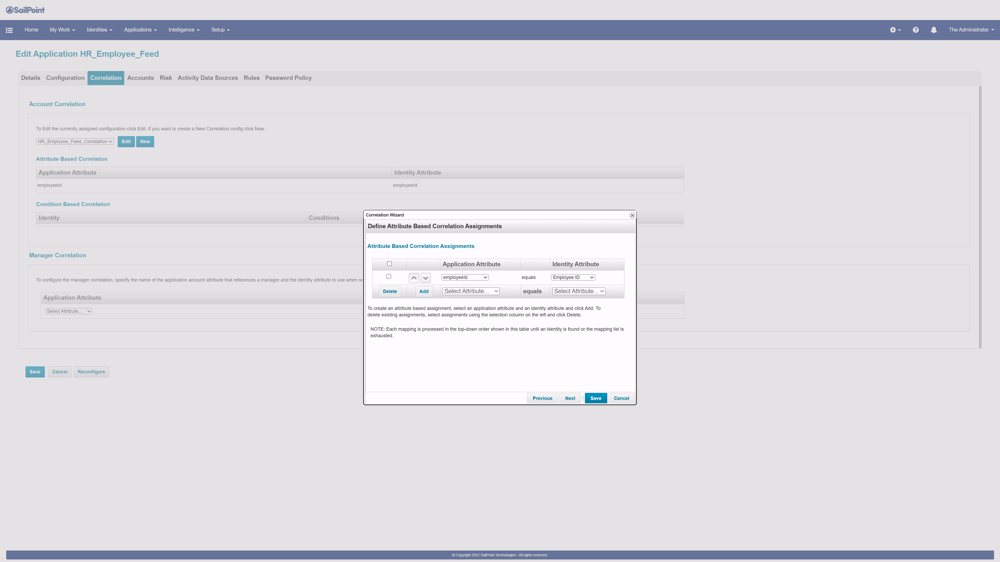
*Screenshot 22, Middle: the correlation wizard with one rule, employeeId equals Employee ID.*

### Snag: the manager lookup was in the wrong section

While rebuilding correlation I added a second rule, `managerId` equals Employee ID, in the same place.

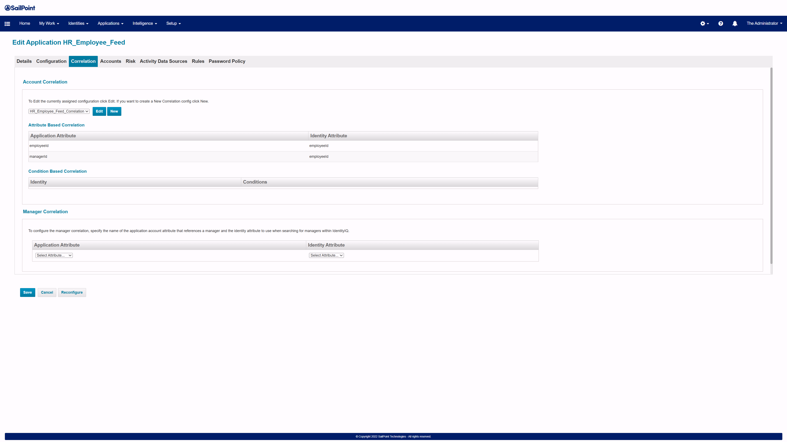
*Screenshot 23, Snag: the Correlation tab with two rules under account correlation. The second one, managerId to employeeId, does not belong here.*

I caught it before rerunning anything. Account correlation rules run top down until an identity is found. If Ava's first rule ever failed, the second rule would have matched her account to **Priya's identity**, because Ava's `managerId` is E1003. That would have merged an employee into her manager.

| Item | Detail |
|---|---|
| **Layer** | Correlation design |
| **Root cause** | I treated "match an account to an identity" and "link an employee to a manager" as the same job. They are two jobs in two sections. |
| **Fix** | Deleted the second row from account correlation and entered it in the separate **Manager Correlation** section as `managerId` to Employee ID |

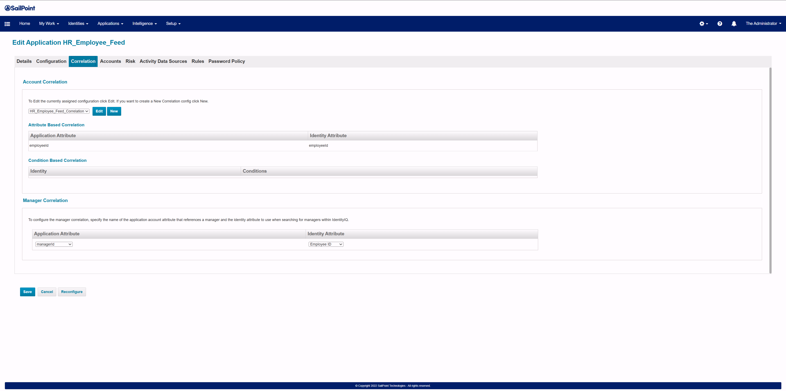
*Screenshot 24, End: one account correlation rule, and a separate Manager Correlation entry mapping `managerId` to Employee ID.*

### Engineer notes
* **Correlate on a stable unique key, never on a name.** Names change and collide. An employee ID does not.
* **Searchable matters.** The attribute has to be searchable for the lookup and for the identity search I use later.
* **Review the configuration before the rerun, not after it corrupts data.**

### Real world mapping
This is the classic "two Alex Kims became one identity" problem. Correlation on a unique key is what prevents it, and manager linking has to stay separate from it.

---

## Part 5: Making the manager relationships work

### Situation
Ava and Marcus both report to Priya, and the HR file says so with `managerId` E1003 on each of their lines. I wanted the Manager column to show Priya Shah for both, and to stay blank for Priya without any error.

### Build
Manager Correlation was already configured in Part 4. I reran the aggregation and looked at the Manager column.

### Snag: the Manager column stayed blank

Every task finished with Success. The Manager column stayed empty. This is the longest troubleshooting story in this repo, so I kept every run on record and worked through it one variable at a time.

| # | Time | What I ran | What I saw | What it ruled out |
|---|---|---|---|---|
| 1 | 8:04 PM | Second aggregation with optimization of unchanged accounts disabled | 3 identities updated, none created, still 4 in the warehouse, Manager blank (Screenshots 25 to 28) | Duplicate identities, and unchanged accounts being skipped |
| 2 | 8:12 PM | Third aggregation, same settings | Success, Manager blank (Screenshot 26 shows the run on record) | Processing order, meaning the manager's ID not being stored yet when the reports were read |
| 3 | Not timed | Identity Search on Employee ID | E1001, E1002, and E1003 stored, Manager blank (Screenshot 29) | Bad or missing data |
| 4 | Not timed | Checked the application's Details tab | Authoritative Application already checked (Screenshot 04) | The authoritative setting |
| 5 | 8:23 PM | Identity Refresh with Refresh identity attributes and Refresh manager status | 4 identities examined, Manager blank (Screenshots 30 to 32) | A missing refresh |
| 6 | Not timed | Advanced Analytics search with Is Manager set to True | Zero results (Screenshot 33) | A display problem. SailPoint held no manager relationship at all. |
| 7 | Not timed | Opened the Manager identity attribute | Attribute Type Identity, Read Only, Source Mappings empty (Screenshot 34). I assumed that was default behavior and left it alone. | Nothing yet |
| 8 | 8:37 PM | Checked the Tomcat log, restarted Tomcat, reran the aggregation | Clean log, 3 identities updated, Manager still blank (Screenshots 35 to 38) | Errors in the log, and cached configuration |

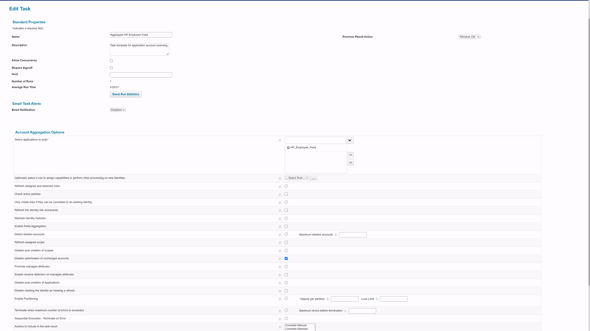
*Screenshot 25, Beginning of the rerun: Edit Task with Previous Result Action set to Rename Old and Disable optimization of unchanged accounts checked.*

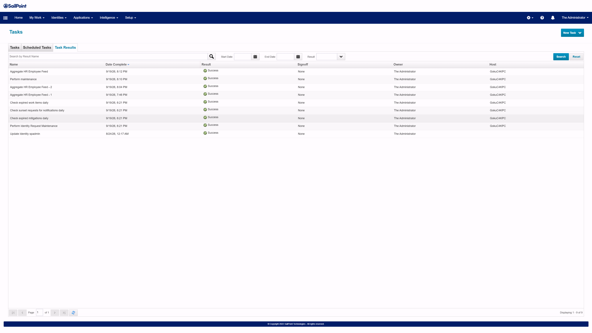
*Screenshot 26, Middle: Task Results with every run kept on record.*


*Screenshot 27, Middle: the second aggregation. 3 accounts scanned, 3 identities updated, none created.*


*Screenshot 28, Middle: the Identity Warehouse after the reruns. Still 4 identities, and the Manager column is blank.*

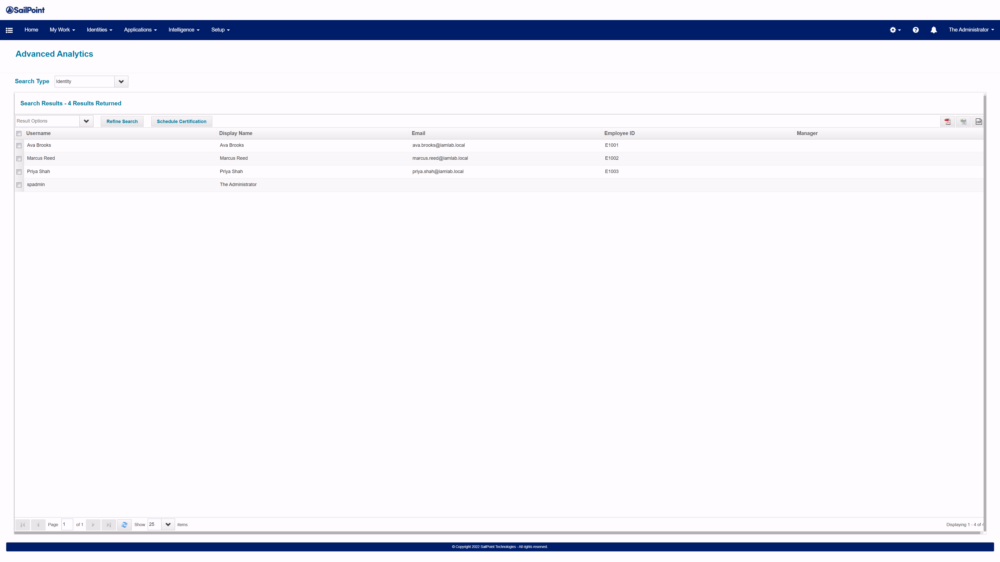
*Screenshot 29, Middle: an identity search. E1001, E1002, and E1003 are stored on the identities, and the Manager column is blank.*

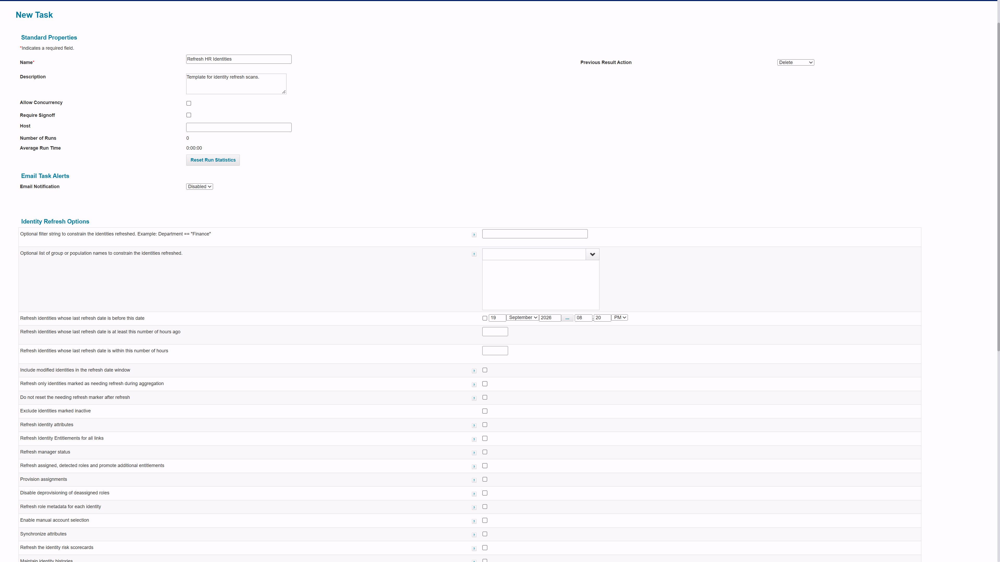
*Screenshot 30, Middle: the Identity Refresh task form before I selected any options.*

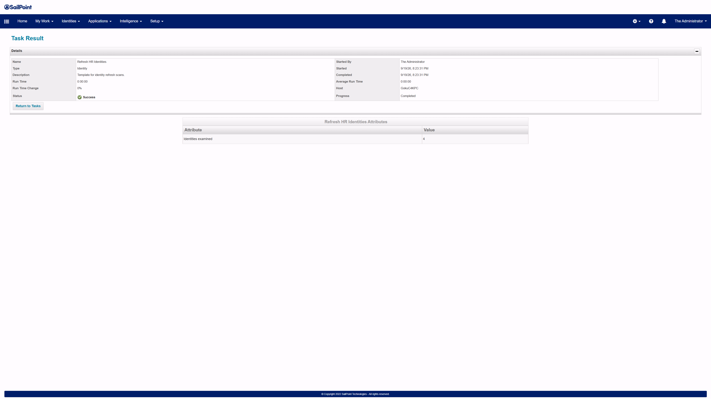
*Screenshot 31, Middle: the first refresh. Success, 4 identities examined, no managers reported.*

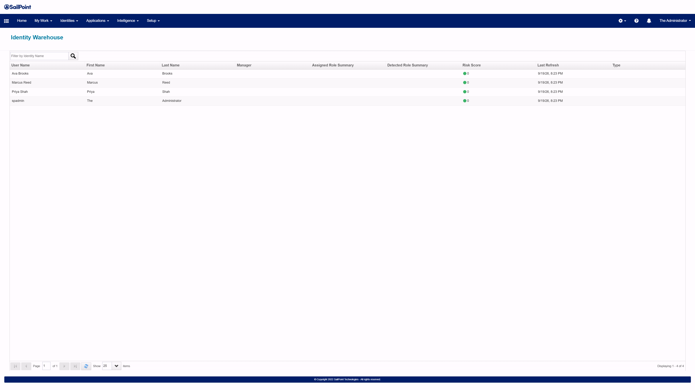
*Screenshot 32, Middle: the Identity Warehouse at 8:23 PM after the refresh. Every identity was touched, and Manager is still blank.*

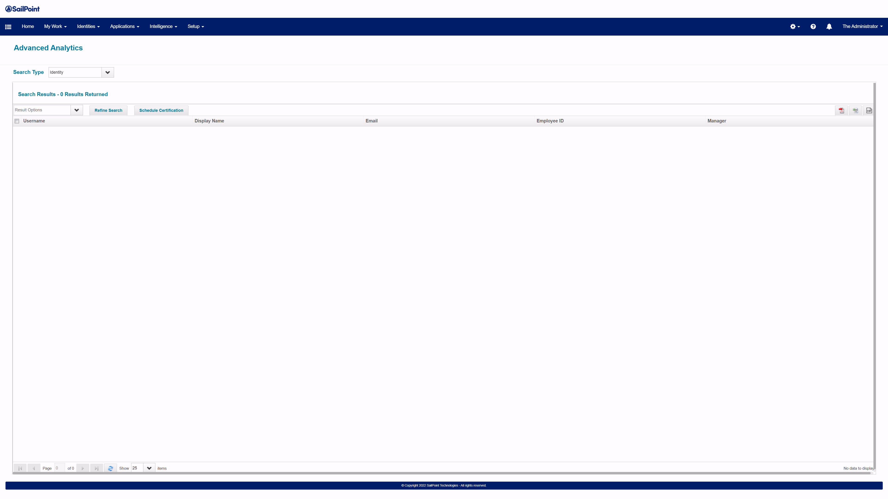
*Screenshot 33, Middle: an Is Manager search returns zero results. SailPoint does not consider anyone a manager.*

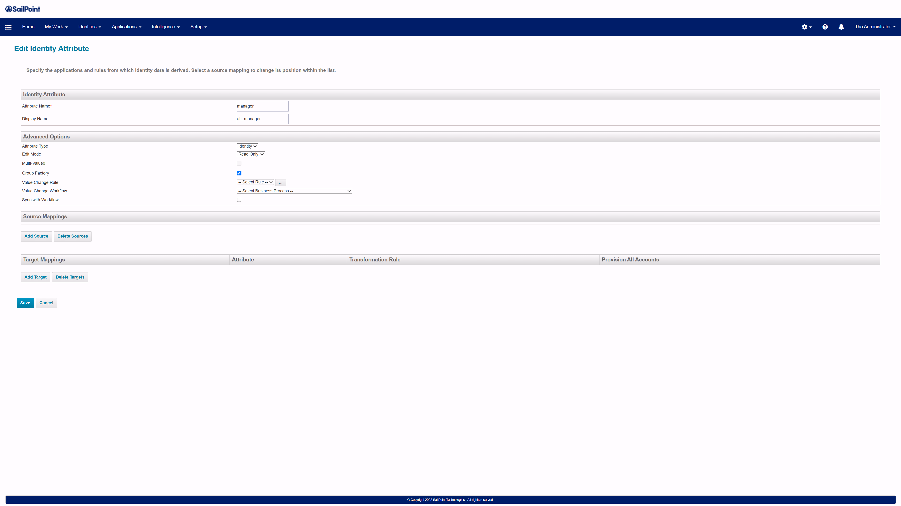
*Screenshot 34, Middle: the Manager identity attribute. Attribute Type Identity, Edit Mode Read Only, and no Source Mappings.*

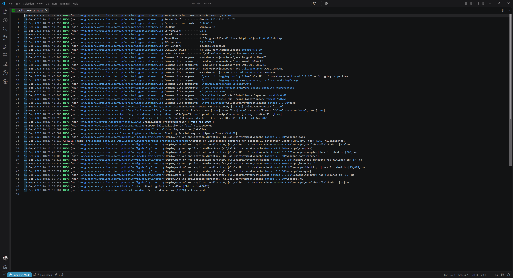
*Screenshot 35, Middle: the Tomcat log. A clean startup at 6:21 PM with one harmless SecureRandom warning, and nothing about managers or correlation.*

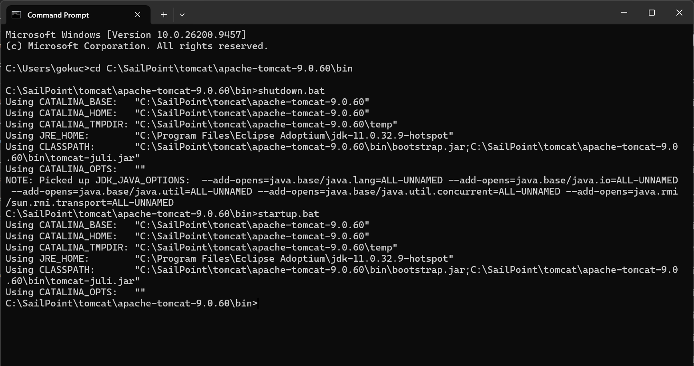
*Screenshot 36, Middle: stopping and starting Tomcat to rule out cached configuration.*

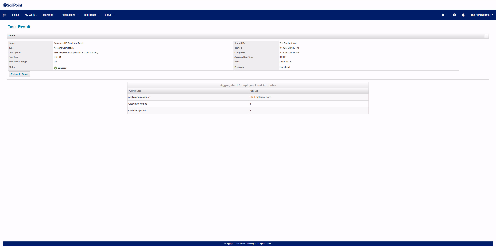
*Screenshot 37, Middle: the aggregation after the restart. 3 accounts scanned and 3 identities updated.*

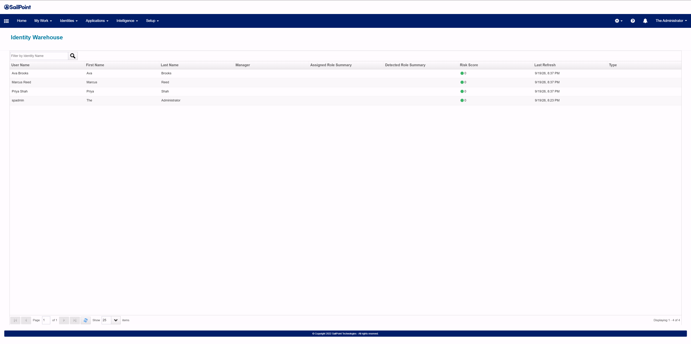
*Screenshot 38, Middle: the Identity Warehouse at 8:37 PM after the restart. Manager is still blank.*

### Root cause

When every visible setting looked right and the output was still wrong, I stopped changing settings and went to the vendor documentation. The SailPoint community wiki page on manager correlation describes it as a **two part setup**:

1. The **Manager identity attribute** needs a source under Global Settings, Identity Mappings, Manager. That is where the manager value comes from.
2. **Manager Correlation** on the HR application tells IdentityIQ how to look that manager up.

I had done only the second part. The application knew how to find a manager, but the Manager attribute had no value to look up. That one empty Source Mappings section, in Screenshot 34, was the answer the whole time.

### The fix

| Step | What I did |
|---|---|
| 1 | Opened the Manager identity attribute and clicked **Add Source** |
| 2 | Chose Application Attribute, application `HR_Employee_Feed`, attribute `managerId`, and left "Add this source as a target" unchecked |
| 3 | Saved, then confirmed the Identity Attributes list showed the new mapping |
| 4 | Ran the Identity Refresh task again with Refresh identity attributes and Refresh manager status checked, and Previous Result Action set to Rename Old |

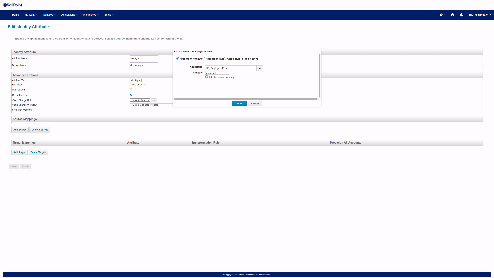
*Screenshot 39, the fix: the Add Source popup for the Manager attribute. `HR_Employee_Feed`, `managerId`.*


*Screenshot 40, after the fix: Source Mappings reads "managerId from the HR_Employee_Feed application."*

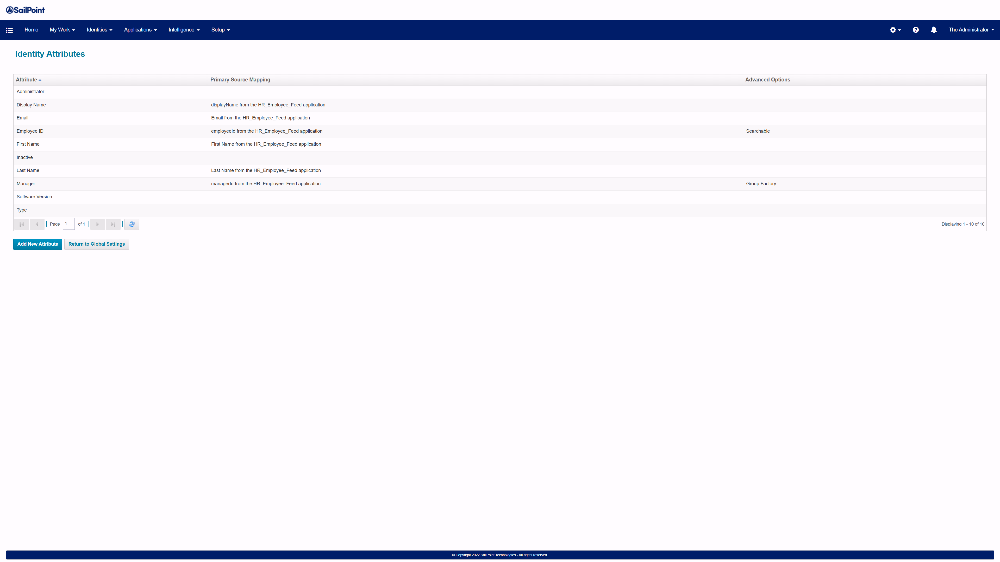
*Screenshot 41, after the fix: the Identity Attributes list with six mappings, including Manager.*

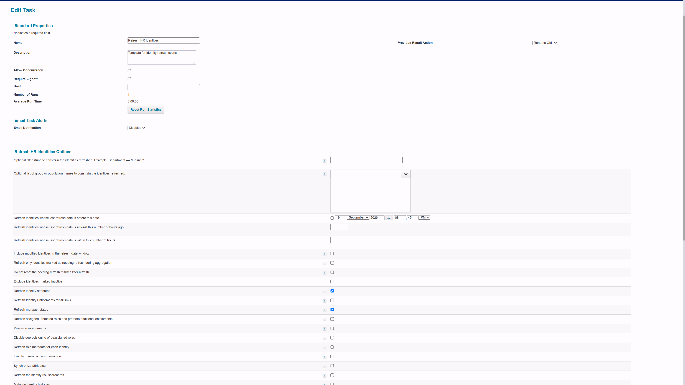
*Screenshot 42, Middle: the Identity Refresh task with Refresh identity attributes and Refresh manager status checked, and Rename Old set.*

### What happened
The refresh finished with **4 identities examined and 1 manager discovered**. That line had not appeared in any earlier run.

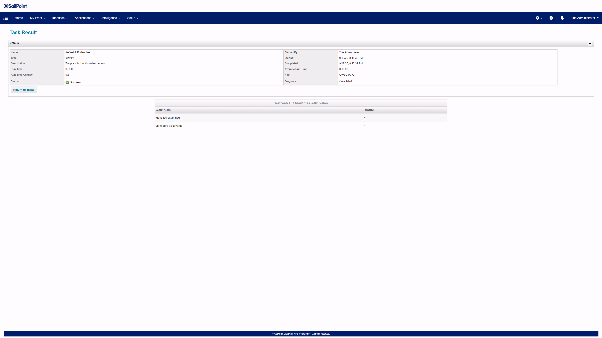
*Screenshot 43, Middle: the refresh at 8:45 PM. Success, 4 identities examined, 1 manager discovered.*

The Manager column now reads Priya Shah for Ava Brooks and Marcus Reed. Priya's Manager is blank, and it caused no error.

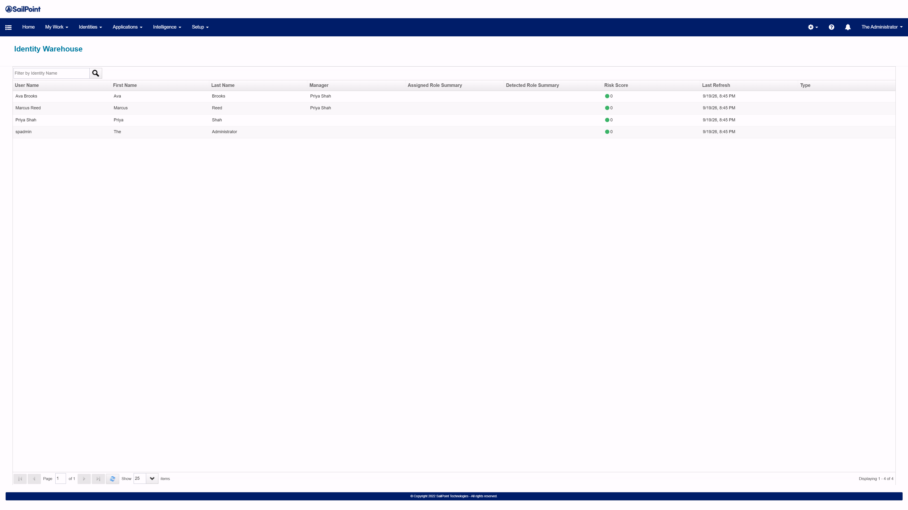
*Screenshot 44, End: the Identity Warehouse. Priya Shah appears in the Manager column for Ava Brooks and Marcus Reed. Priya's own Manager is blank.*

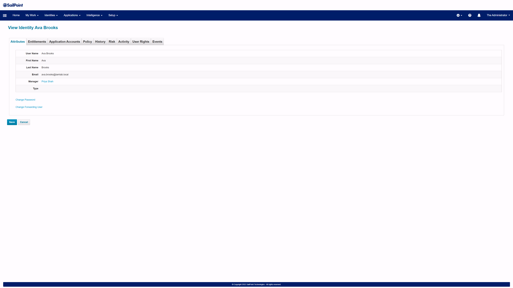
*Screenshot 45, End: Ava Brooks's Attributes tab. Manager is Priya Shah, shown as a link.*

### Engineer notes
* **One worry did not come true.** The source supplies `managerId` (E1003), while Priya's username is "Priya Shah." I was not sure Manager Correlation would bridge that gap on this build. It did.
* **A blank `managerId` is handled cleanly.** Priya's line has no manager, and IdentityIQ left the field blank with no error. That matters for every executive record in a real HR feed.
* **A Success status only means the task finished.** It does not mean it did the right work. The Is Manager search is what told me the truth, and I should have run it earlier.
* **I spent several reruns changing things that were already correct.** When the configuration looks right and the result is wrong, I now check my mental model against the documentation before the next rerun.

### Real world mapping
Managers drive approvals and access certifications. If the manager link is wrong or missing, the wrong person approves access or nobody does. Getting a clean relationship from the HR feed into the identity platform is the first step of every access review.

---

## Final result

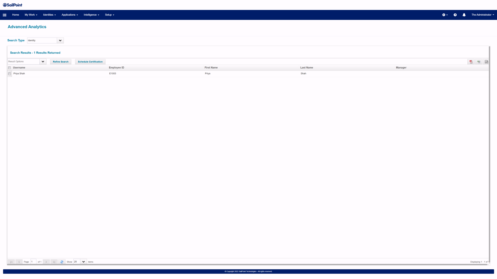
*Screenshot 46, End: the same Is Manager search that returned zero results in Screenshot 33 now returns Priya Shah, Employee ID E1003.*

| Deliverable | Status | Evidence |
|---|---|---|
| HR file connected as an authoritative source | Working after an empty schema error | Screenshots 04 to 08 |
| 13 attribute schema | Done, all 13 populated on the account | Screenshots 06, 07, and 19 |
| Correlation | Working on Employee ID, reruns updated the same 3 identities and created none | Screenshots 09, 10, 22, 27, and 28 |
| Identity mappings | Six mapped: Display Name, Email, Employee ID, First Name, Last Name, and Manager | Screenshots 11 to 14, 21, 40, and 41 |
| First aggregation | 3 accounts scanned, 3 identities created, one second run time | Screenshots 15 to 19 |
| Manager relationships | Working after a missing Manager attribute source was found. Two employees linked to their manager and the top of the org stayed blank without errors | Screenshots 33, 34, and 39 to 46 |

---

## Verification log

The most useful habit in this lab was checking the result in the place that actually holds the data, instead of trusting the status on the screen I ran it from.

| Part | What could have hidden a problem | How I checked | What the evidence showed |
|---|---|---|---|
| Source | A file that opens is not a file SailPoint understands | Test Connection, then the Schema tab | An empty schema was caught, fixed, and tested again (see Part 1) |
| Correlation | A rule that works on new accounts can fail on existing ones | Reran the aggregation with optimization of unchanged accounts disabled | 3 identities updated, still 4 in the warehouse, none created |
| Attributes | A Success status does not prove the data landed | Identity Search on Employee ID, and the account's Application Accounts tab | E1001, E1002, and E1003 stored, and all 13 attributes on the account |
| Managers | A green task does not prove a relationship exists | An Is Manager search and the warehouse Manager column | Zero results before the fix, Priya returned after (see Part 5) |

---

## What I would change before calling this production ready

* Decide identity naming on purpose, so usernames are not display names that can change.
* Deliver the file on a schedule (SFTP in Identity Security Cloud) and schedule the aggregation and refresh tasks instead of running them by hand.
* Turn on **Detect deleted accounts**, so people removed from the HR file are noticed.
* Add a rule for blank manager values, covering both the top of the org and leavers.
* Keep old task results with Rename Old, and set a retention rule so they do not pile up.
* Add a second source and test correlation across systems.
* Build Joiner and Leaver workflows on top of this source (Week 6).

---

## Interview talking points (Problem, Solution, Impact, Learning)

**"Tell me about a project where you connected an authoritative source."**
* **Problem:** An identity platform cannot manage access until it knows who works at the company and who they report to.
* **Solution:** I connected an HR file to IdentityIQ as an authoritative source, built a 13 attribute schema, correlated accounts on Employee ID, mapped six identity attributes, and configured manager correlation.
* **Impact:** Three test employees became three identities with all 13 attributes, reruns updated them instead of duplicating them, and both direct reports linked to their manager.
* **Learning:** Correlate on a stable unique key and never on a name, and check the data in the place that holds it.

**"Tell me about a time something reported Success but was wrong."**
* **Problem:** Every aggregation and refresh finished with Success, yet the Manager column stayed blank.
* **Solution:** I changed one variable at a time and kept every run on record. I confirmed the data with an identity search, ruled out the authoritative setting, correlation placement, refresh options, and cached configuration, then checked the vendor documentation and found the Manager attribute needed its own source.
* **Impact:** Both direct reports linked to their manager, the top of the org stayed blank without errors, and I had a documented trail showing what each check ruled out.
* **Learning:** A success status only means a task finished. Verify the output, and check your mental model against the documentation when a correct looking setup gives a wrong result.

**"How do you correlate accounts to identities?"**
I match on a stable unique attribute, here the employee ID, in an ordered list of rules that run top down until an identity is found. I keep manager linking separate, because matching an account to a person and linking a person to their manager are different jobs.

**"What is the difference between an aggregation and an identity refresh?"**
An aggregation reads accounts from a source and correlates them to identities. An identity refresh goes back over the identities and recalculates the values stored on them, like manager status. My manager fix needed both a mapping and a refresh.

---

## Resume bullet

> Configured a SailPoint IdentityIQ 8.3 authoritative source with a custom 13 attribute schema and Employee ID correlation, and aggregated 3 test identities with full attribute mapping from a delimited HR file.
>
> Diagnosed an empty account schema, a task naming rule, a username and correlation design flaw, and a manager relationship that returned Success but stayed blank. Traced the last one to a missing Manager identity attribute source by ruling out data, correlation, refresh, and cached configuration in order, then confirming against vendor documentation.

*Only add a percentage or ticket reduction number if you have a measured manual baseline to compare against.*

---

## Repository layout

```
sailpoint_iiq_hr_source_aggregation/
├── README.md
├── evidence/
│   └── 01_hr_feed.csv
└── screenshots/
    ├── 01_hr_feed_csv_file_created.png
    ├── 02_identityiq_login_success.png
    ├── 03_identity_warehouse_baseline_before_aggregation.png
    ├── 04_hr_employee_feed_application_details_authoritative_checked.png
    ├── 05_test_connection_error_empty_schema.png
    ├── 06_schema_identity_attribute_employeeid_set.png
    ├── 07_schema_display_attribute_displayname_set.png
    ├── 08_test_connection_success_after_schema_fix.png
    ├── 09_correlation_tab_empty_before_config.png
    ├── 10_correlation_wizard_employeeid_equals_username.png
    ├── 11_identity_attributes_list_before_mappings.png
    ├── 12_email_identity_attribute_source_mapped.png
    ├── 13_displayname_add_source_popup_hr_employee_feed.png
    ├── 14_identity_attributes_list_four_mappings_saved.png
    ├── 15_aggregation_task_name_error_underscore_not_allowed.png
    ├── 16_aggregation_task_configured_with_valid_name.png
    ├── 17_aggregation_result_three_accounts_three_identities_created.png
    ├── 18_identity_warehouse_usernames_are_display_names.png
    ├── 19_ava_brooks_application_account_13_attributes.png
    ├── 20_employee_id_attribute_created_no_source.png
    ├── 21_employee_id_source_mapped_hr_employee_feed.png
    ├── 22_correlation_wizard_employee_id_rule.png
    ├── 23_correlation_wizard_wrong_manager_row_caught.png
    ├── 24_correlation_and_manager_correlation_fixed.png
    ├── 25_aggregation_task_rerun_optimization_disabled.png
    ├── 26_task_results_three_runs_preserved.png
    ├── 27_second_aggregation_result_three_identities_updated.png
    ├── 28_identity_warehouse_manager_blank_after_reruns.png
    ├── 29_identity_search_employee_id_values_present.png
    ├── 30_identity_refresh_task_options_before_selection.png
    ├── 31_identity_refresh_first_result_four_identities_examined.png
    ├── 32_identity_warehouse_manager_blank_after_identity_refresh.png
    ├── 33_identity_search_is_manager_true_zero_results.png
    ├── 34_manager_identity_attribute_default_no_source.png
    ├── 35_tomcat_catalina_log_clean_startup_no_errors.png
    ├── 36_tomcat_restart_shutdown_and_startup.png
    ├── 37_aggregation_after_restart_result_manager_still_blank.png
    ├── 38_identity_warehouse_manager_blank_after_restart.png
    ├── 39_manager_add_source_popup_managerid.png
    ├── 40_manager_identity_attribute_source_added.png
    ├── 41_identity_attributes_list_all_six_mapped.png
    ├── 42_identity_refresh_task_configured_manager_status.png
    ├── 43_identity_refresh_result_managers_discovered.png
    ├── 44_identity_warehouse_managers_linked.png
    ├── 45_ava_brooks_manager_priya_shah.png
    └── 46_identity_search_is_manager_true_returns_priya.png
```

*Built as part of the IAM Engineer Mentorship Program, Week 5. This is a lab environment with test data only.*
# sailpoint_iiq_hr_source_aggregation

# sailpoint_iiq_hr_source_aggregation

